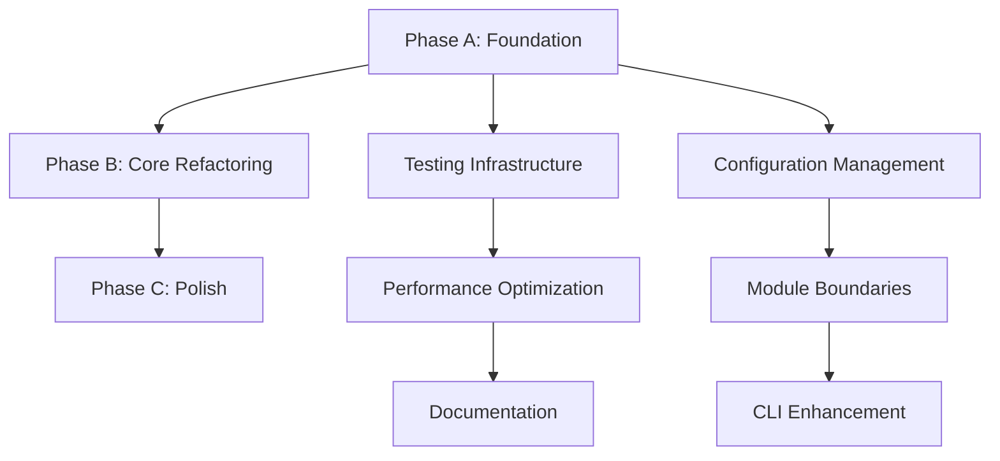

# ARCH_PROPOSAL.md

## Target Architecture

### Proposed Module Boundaries

```
SPOT_VISO_Cleaned2/
├── spotviso/                  # Package root with proper __init__.py
│   ├── core/                  # Pure computation (no viz dependencies)
│   │   ├── geometry/          # Axis, CrossSection, coordinate transforms  
│   │   ├── objects/           # DeckObject, PierObject, FoundationObject
│   │   ├── variables/         # AxisVariable, parametric evaluation
│   │   └── context/           # VisoContext, object graph management
│   ├── io/                    # Data loading & serialization
│   │   ├── loaders.py         # SpotLoader refactored
│   │   ├── filters.py         # SPOT_Filters cleaned up
│   │   └── config.py          # Configuration management
│   ├── viz/                   # Visualization layer (separate from core)
│   │   ├── plotly_renderer.py # Plotly-specific rendering
│   │   ├── traces.py          # Trace generation utilities
│   │   └── html_export.py     # HTML template and export
│   └── cli/                   # Command-line interfaces
│       ├── main.py            # Main visualization CLI
│       ├── deck.py            # run_deck.py refactored  
│       ├── pier.py            # run_pier.py refactored
│       └── foundation.py      # run_foundation.py refactored
├── tests/                     # Automated test suite
│   ├── unit/                  # Unit tests per module
│   ├── integration/           # Cross-module integration tests
│   ├── performance/           # Performance regression tests
│   └── fixtures/              # Test data and mock objects
├── config/                    # Configuration templates
├── pyproject.toml             # Modern Python packaging
└── README.md                  # Updated documentation
```

### Public Interface Design

#### Core Geometry API
```python
# spotviso.core.geometry
class Axis:
    def get_position_at_station(self, station_mm: float) -> np.ndarray[3]
    def get_frames_at_stations(self, stations_mm: np.ndarray) -> Tuple[np.ndarray, np.ndarray, np.ndarray]
    def embed_points_world(self, stations_mm: np.ndarray, local_points: np.ndarray, 
                          rotation_deg: float = 0.0) -> np.ndarray

class CrossSection:  
    def evaluate_at_stations(self, variables: Dict[str, np.ndarray], 
                           *, units: str = "mm") -> SectionGeometry
    def get_point_topology(self) -> List[np.ndarray]  # Loop indices

# Return type for better API design
@dataclass
class SectionGeometry:
    point_ids: List[str]
    local_coords: np.ndarray  # (N_stations, N_points, 2) - Y,Z coordinates
    loop_indices: List[np.ndarray]  # Topology information
    metadata: Dict[str, Any]
```

#### Object Computation API  
```python
# spotviso.core.objects
@dataclass
class GeometryResult:
    world_coords: np.ndarray      # (N_stations, N_points, 3) in mm
    local_coords: np.ndarray      # (N_stations, N_points, 2) for reference
    stations_mm: np.ndarray       # Station positions used
    point_ids: List[str]          # Point identifiers
    topology: List[np.ndarray]    # Loop connectivity
    metadata: Dict[str, Any]      # Additional object-specific data

class StructuralObject:
    def compute_geometry(self, *, stations_mm: Optional[np.ndarray] = None,
                        context: Optional[VisoContext] = None) -> GeometryResult
```

#### Configuration API
```python  
# spotviso.io.config
@dataclass
class SpotConfig:
    data_root: Path
    default_branch: str = "MAIN"
    default_units: str = "mm"
    cache_enabled: bool = True
    max_stations: int = 10000
    
    @classmethod  
    def from_file(cls, path: Union[str, Path]) -> SpotConfig
    
    @classmethod
    def from_env(cls) -> SpotConfig  # Environment variable based
```

## Migration Plan

### Phase A: Foundation & Testing (Week 1-2)  
**Objective**: Establish solid foundation for safe refactoring

#### Files Touched
- `tests/` (new directory structure)
- `pyproject.toml` (new)
- `config/default.toml` (new)
- `spotviso/__init__.py` (new package structure)

#### Changes  
1. **Add pytest infrastructure**
   ```bash
   pip install pytest pytest-cov pytest-benchmark
   ```

2. **Create core smoke tests**
   ```python
   # tests/unit/test_axis.py
   def test_axis_interpolation_basic():
       axis = Axis([0, 1000], [0, 1000], [0, 0], [0, 0], units="mm") 
       pos = axis.get_position_at_station(500.0)
       assert_allclose(pos, [500, 0, 0], rtol=1e-6)
   
   # tests/integration/test_geometry_pipeline.py
   def test_deck_geometry_computation():
       # Full pipeline test with known good data
       assert result.world_coords.shape[2] == 3  # 3D coordinates
       assert not np.isnan(result.world_coords).any()  # No NaN values
   ```

3. **Configuration management**
   ```python
   # spotviso/io/config.py  
   class SpotConfig:
       def __init__(self):
           self.data_root = Path(os.getenv("SPOT_DATA_ROOT", "./GIT"))
           self.units = os.getenv("SPOT_UNITS", "mm")
   ```

#### Acceptance Criteria
- [ ] All existing CLI commands run without regression  
- [ ] Test suite passes with >70% coverage on core modules
- [ ] Configuration system replaces all hard-coded paths
- [ ] Performance baseline established (benchmark current performance)

#### Rollback Plan
- Git branch isolation - simply revert merge if issues found
- No breaking API changes in Phase A
- Original entry points preserved

### Phase B: Core Refactoring & Performance (Week 3-4)
**Objective**: Clean up architecture boundaries and optimize hot paths

#### Files Touched  
- `models/axis.py` → `spotviso/core/geometry/axis.py`
- `models/cross_section.py` → `spotviso/core/geometry/cross_section.py`  
- `models/axis_variable.py` → `spotviso/core/variables/axis_variable.py`
- `spot_loader.py` → `spotviso/io/loaders.py`

#### Changes
1. **Vectorize critical hot paths**
   ```python
   # Before: Loop-based section evaluation
   for j, pid in enumerate(order):
       for i in range(len(stations_mm)):
           result[i, j, :] = evaluate_expression(...)
   
   # After: Vectorized evaluation  
   station_arrays = np.broadcast_to(stations_mm[:, None], (n_stations, n_points))
   results = np.vectorize(evaluate_expression)(expressions, station_arrays, variables)
   ```

2. **Add computation caching**
   ```python
   from functools import lru_cache
   from typing import Tuple
   
   class Axis:
       @lru_cache(maxsize=128)
       def _get_frames_cached(self, stations_hash: int) -> Tuple[np.ndarray, np.ndarray, np.ndarray]:
           return self.parallel_transport_frames(stations_from_hash(stations_hash))
   ```

3. **Separate visualization concerns**
   - Move all `matplotlib` imports out of `models/`
   - Create clean `spotviso.viz` module with no reverse dependencies

#### Acceptance Criteria  
- [ ] 2-5x performance improvement on station processing
- [ ] Clean module boundaries (no viz imports in core)  
- [ ] Backward compatible API (existing scripts still work)
- [ ] Memory usage stable or improved

#### Rollback Plan
- Feature flags for new vs. old implementations
- Performance regression detection in CI
- Gradual migration with A/B testing capability

### Phase C: Polish & Documentation (Week 5-6)
**Objective**: Production-ready packaging and comprehensive documentation

#### Files Touched
- `README.md` (comprehensive rewrite)
- `docs/` (new directory with API documentation)
- `spotviso/cli/` (refactored entry points)
- `.github/workflows/` (CI/CD pipeline)

#### Changes  
1. **Modern Python packaging**
   ```toml
   # pyproject.toml
   [project]
   name = "spotviso"
   version = "2.0.0"  
   dependencies = ["numpy>=1.20", "scipy>=1.7", "plotly>=5.0"]
   
   [project.scripts]
   spotviso = "spotviso.cli.main:main"
   spotviso-deck = "spotviso.cli.deck:main"
   ```

2. **Comprehensive CLI interface**
   ```bash
   spotviso render --branch MAIN --output combined.html
   spotviso check --data-root ./GIT  # Validation mode
   spotviso benchmark --stations 1000  # Performance testing
   ```

3. **API documentation with examples**
   ```python
   # README.md code examples
   from spotviso import SpotConfig, SpotLoader
   
   config = SpotConfig.from_file("config.toml")
   loader = SpotLoader(config)
   context = loader.load_branch("MAIN")
   
   deck = context.get_deck_objects()[0]  
   geometry = deck.compute_geometry()
   print(f"Generated {geometry.world_coords.shape} world coordinates")
   ```

#### Acceptance Criteria
- [ ] Complete API documentation with examples
- [ ] Automated CI/CD pipeline with testing and benchmarks  
- [ ] Zero hard-coded paths or configuration
- [ ] Installable via `pip install .`
- [ ] All CLI commands have `--help` documentation

#### Rollback Plan
- Documentation and packaging changes are non-breaking
- CLI changes maintain backward compatibility with original `run_*.py` scripts
- Original module structure preserved alongside new package structure

## Implementation Priority

### Critical Path Dependencies


### Risk Mitigation
1. **Preserve original functionality** - All existing entry points continue working
2. **Gradual migration** - New APIs introduced alongside existing ones
3. **Comprehensive testing** - Every change validated with automated tests  
4. **Performance monitoring** - Continuous benchmarking to detect regressions
5. **Documentation-driven development** - API design documented before implementation

### Success Metrics
- **Performance**: 2-5x improvement in hot path computation  
- **Maintainability**: >90% test coverage, clean module boundaries
- **Usability**: Zero hard-coded configuration, comprehensive CLI help
- **Compatibility**: 100% backward compatibility for existing workflows