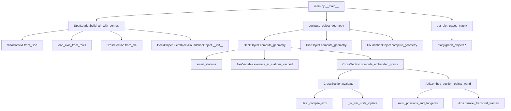

# CALL_GRAPH.md

## Main Compute Path Call Graph

This call graph focuses on the critical path from data loading through geometry computation to visualization output.

## Pivotal Functions

### Data Loading Pipeline

#### `SpotLoader.build_all_with_context()` 
- **File**: `spot_loader.py:83`
- **Signature**: `build_all_with_context(self, *, verbose: bool = True) -> SpotLoader`
- **Returns**: Self with populated `ctx` (VisoContext) and typed object collections
- **Units**: Handles mixed meter/millimeter inputs, normalizes to mm internally
- **Preconditions**: `load_raw()` and `group_by_class()` must be called first
- **Postconditions**: `self.ctx` contains fully wired object graph with resolved references
- **Hotspot**: ❌ Not performance critical - runs once per data load

#### `VisoContext.from_json()`
- **File**: `models/viso_context.py:31`
- **Signature**: `from_json(cls, axis_rows, cross_sections, mainstations, mapping_cfg, verbose=False) -> VisoContext`
- **Returns**: Fully populated context with indexed object collections
- **Units**: Assumes millimeter internal storage for coordinates  
- **Preconditions**: Valid JSON row data with required fields per mapping_cfg
- **Postconditions**: All cross-references resolved, axes/sections indexed by name/NCS
- **Hotspot**: ❌ Setup phase only

### Core Computation Pipeline

#### `compute_object_geometry()` (Dispatcher)
- **File**: `main.py:1457`  
- **Signature**: `compute_object_geometry(obj, ctx, stations_m=None, slices=None, twist_deg=0.0, negate_x=True)`
- **Returns**: `{"ids": list, "stations_mm": ndarray, "points_mm": ndarray(S,N,3), "local_Y_mm": ndarray(S,N), "local_Z_mm": ndarray(S,N), "loops_idx": list}`
- **Units**: Input stations in meters, output coordinates in millimeters
- **Preconditions**: Object must have compute_geometry method and valid context references
- **Postconditions**: World coordinates ready for visualization, maintains point topology
- **Hotspot**: 🔥 **HIGH** - Called for every renderable object

#### `LinearObject.compute_geometry()` (Base Implementation) 
- **File**: `models/linear_object.py:150` (approximate)
- **Signature**: `compute_geometry(self, ctx, stations_m=None, twist_deg=0.0, negate_x=True)`
- **Returns**: Geometry dictionary with embedded world coordinates  
- **Units**: stations_m in meters, coordinates in mm, rotations in degrees
- **Preconditions**: `axis_obj` and cross-section references must be resolved
- **Postconditions**: 3D points array shape (stations × points × 3), topology preserved
- **Hotspot**: 🔥 **HIGH** - Core computation path for all structural objects

### Section Evaluation (Hot Path)

#### `CrossSection.evaluate()` 
- **File**: `models/cross_section.py:67`
- **Signature**: `evaluate(self, var_arrays_all, *, negate_x=True, debug_units=False, force_var_scale=None) -> Tuple[List[str], ndarray, ndarray, List[ndarray]]`
- **Returns**: `(ids, X_mm, Y_mm, loops_idx)` - point IDs, coordinates, topology
- **Units**: Input variables assumed meters → scaled to mm; outputs in mm
- **Preconditions**: var_arrays_all contains required variables as numpy arrays
- **Postconditions**: Local coordinates evaluated, unit scaling applied
- **Hotspot**: 🔥 **CRITICAL** - Nested loops over stations and points, expression evaluation per point
- **Optimization Target**: Replace expression eval loops with vectorized numpy operations

#### `CrossSection.compute_embedded_points()`
- **File**: `models/cross_section.py:272` (approximate)
- **Signature**: `compute_embedded_points(self, axis_var_results, axis, stations_mm, ...)`
- **Returns**: World coordinates (stations × points × 3) and metadata
- **Units**: stations_mm in mm, output world coordinates in mm
- **Preconditions**: Axis must provide valid position/tangent data at all stations  
- **Postconditions**: Local section points transformed to world coordinates
- **Hotspot**: 🔥 **CRITICAL** - Called per object per render, matrix operations per station

### Axis Computation (Hot Path)

#### `Axis._positions_and_tangents()`
- **File**: `models/axis.py:125` (approximate)
- **Signature**: `_positions_and_tangents(self, stations_mm) -> Tuple[ndarray, ndarray]`  
- **Returns**: `(P, T)` where P:(N,3) positions, T:(N,3) unit tangents in mm
- **Units**: Input/output in millimeters 
- **Preconditions**: stations_mm within axis domain bounds
- **Postconditions**: Tangent vectors are unit length, positions interpolated
- **Hotspot**: 🔥 **HIGH** - Called for every axis evaluation, spline interpolation

#### `Axis.parallel_transport_frames()`  
- **File**: `models/axis.py:188`
- **Signature**: `parallel_transport_frames(self, stations_mm) -> Tuple[ndarray, ndarray, ndarray]`
- **Returns**: `(T, N, B)` - tangent, normal, binormal frames (N,3) each
- **Units**: All vectors dimensionless (unit), stations in mm
- **Preconditions**: Valid tangent vectors from _positions_and_tangents
- **Postconditions**: Orthonormal frame triplets, minimal twist between stations
- **Hotspot**: 🔥 **MEDIUM** - Rodrigues rotation per station transition, accumulated drift correction

#### `Axis.embed_section_points_world()`
- **File**: `models/axis.py:240` 
- **Signature**: `embed_section_points_world(self, stations_mm, yz_points_mm, x_offsets_mm=None, rotation_deg=0.0, plan_rotation_deg=0.0) -> ndarray`
- **Returns**: World coordinates (N,M,3) for N stations, M section points
- **Units**: All inputs/outputs in millimeters, rotations in degrees
- **Preconditions**: yz_points_mm shape (M,2) or (N,M,2), valid axis frames
- **Postconditions**: Section points transformed via rotation-minimizing frames
- **Hotspot**: 🔥 **CRITICAL** - Matrix multiplication per station×point combination

### Variable System

#### `AxisVariable.evaluate_at_stations_cached()`
- **File**: `models/axis_variable.py:100` (approximate)
- **Signature**: `evaluate_at_stations_cached(cls, vars_list, stations_m) -> List[Dict]`
- **Returns**: Variable evaluation results per station, LRU cached
- **Units**: stations_m in meters, variable values context-dependent
- **Preconditions**: vars_list contains valid AxisVariable instances  
- **Postconditions**: Results cached by station hash for performance
- **Hotspot**: ⚡ **CACHED** - LRU cache reduces repeated computation cost significantly

## Performance Analysis

### Critical Hotspots (Nested Loops)
1. **`CrossSection.evaluate()`** - Expression evaluation per point per station
2. **`Axis.embed_section_points_world()`** - Matrix operations per station × point
3. **`Axis._positions_and_tangents()`** - Spline interpolation per station
4. **`Axis.parallel_transport_frames()`** - Rodrigues rotation per station pair

### Vectorization Opportunities  
- **Replace station loops** with numpy broadcasting in section evaluation
- **Batch matrix operations** in embedding transformations
- **Vectorize expression evaluation** across all points simultaneously  
- **Pre-compute frame transformations** for common station sets

### Current Caching
- ✅ **AxisVariable.evaluate_at_stations_cached()** - LRU cache for variable results
- ❌ **Missing**: Geometry computation caching 
- ❌ **Missing**: Frame computation memoization
- ❌ **Missing**: Expression compilation caching

### Estimated Performance Gains
- **Vectorization**: 2-5x speedup for typical workloads  
- **Geometry caching**: 3-10x for repeated object rendering
- **Expression caching**: 1.5-2x for parametric evaluations