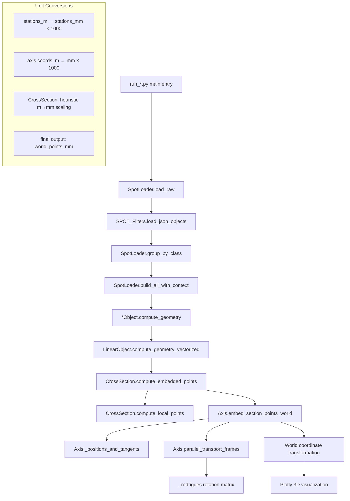

# SPOT VISO - Call Graph

## Main Compute Path: Frame Computation + Section Embedding



## Pivotal Functions

### 1. CrossSection.compute_embedded_points
**Location**: `models/cross_section.py:281`
**Signature**: 
```python
def compute_embedded_points(
    self, *, axis: 'Axis', axis_var_results: List[Dict[str, float]] | None,
    stations_m: List[float] | None, twist_deg: float = 0.0,
    negate_x: bool = True, plan_rotation_deg: float = 0.0,
    frame_mode: str = "pt", debug_units: bool = False,
    force_var_scale: Optional[float] = None
) -> Tuple[List[str], np.ndarray, np.ndarray, np.ndarray, np.ndarray, List[np.ndarray]]
```
**Returns**: `(ids, stations_mm, world_points_mm, X_mm, Y_mm, loops_idx)`
**Shape**: `stations_mm:(N,)`, `world_points_mm:(N,M,3)`, `X_mm,Y_mm:(S,M)`, `loops_idx:List[np.ndarray]`
**Units**: Input `stations_m` in meters, output coordinates in millimeters

### 2. CrossSection.evaluate  
**Location**: `models/cross_section.py:145`
**Signature**: 
```python
def evaluate(
    self, var_arrays_all: Dict[str, np.ndarray], *, negate_x: bool = True,
    debug_units: bool = False, force_var_scale: Optional[float] = None
) -> Tuple[List[str], np.ndarray, np.ndarray, List[np.ndarray]]
```
**Returns**: `(order, X, Y, loops)`
**Shape**: `X,Y:(S,N)` where S=stations, N=points per cross-section  
**Units**: Output local coordinates in millimeters (after unit heuristic scaling)

### 3. Axis.embed_section_points_world
**Location**: `models/axis.py:240`
**Signature**:
```python
def embed_section_points_world(
    self, stations_mm: np.ndarray, yz_points_mm: np.ndarray,
    x_offsets_mm: np.ndarray | None = None, 
    rotation_deg: float | np.ndarray = 0.0,
    plan_rotation_deg: float | np.ndarray = 0.0
) -> np.ndarray
```
**Returns**: `W:(N,M,3)` world coordinates in mm
**Shape**: Input `yz_points_mm:(N,M,2)` or `(M,2)`, output `(N,M,3)`
**Units**: All coordinates in millimeters

### 4. Axis.parallel_transport_frames
**Location**: `models/axis.py:170`  
**Signature**:
```python
def parallel_transport_frames(self, stations_mm: np.ndarray) -> Tuple[np.ndarray, np.ndarray, np.ndarray]
```
**Returns**: `(T, N, B)` - tangent, normal, binormal unit vectors
**Shape**: `T,N,B:(N,3)` for N stations
**Units**: Unit vectors (dimensionless), positions in millimeters

### 5. SpotLoader.build_all_with_context
**Location**: `spot_loader.py:450+`
**Signature**: 
```python
def build_all_with_context(self) -> 'SpotLoader'
```
**Returns**: Self with populated `vis_objs` and `ctx` (VisoContext)  
**Shape**: Creates object lists and cross-reference context
**Units**: Preserves input JSON units, typically mixed meters/millimeters

### 6. LinearObject.compute_geometry_vectorized
**Location**: `models/linear_object.py:100+`
**Signature**:
```python  
def compute_geometry_vectorized(self, stations_m: List[float], ...) -> Dict[str, Any]
```
**Returns**: Geometry dict with `"points_mm"`, `"stations_mm"`, `"loops_idx"`, etc.
**Shape**: `points_mm:(N,M,3)`, varies per object configuration
**Units**: Output in millimeters, input stations in meters

## Notes

### Unit Assumptions
- **Axis coordinates**: Stored internally as millimeters (converted from input meters by ×1000)
- **Cross-section coordinates**: Heuristic unit scaling in `_fix_var_units_inplace()` converts meters to millimeters based on comparison with default values
- **Station values**: Input as meters, internally converted to millimeters for consistency
- **Final output**: All world coordinates in millimeters for Plotly visualization

### Ambiguous Unit Handling
- **CrossSection variables**: Unit detection relies on heuristics comparing median values to defaults - may fail for unusual scales
- **Mixed unit JSON**: Some legacy JSON files may contain mixed units (meters/millimeters) requiring careful validation
- **Plan rotation**: Applied in degrees but transforms millimeter coordinates - no unit conversion issues

### Frame Mode Switching
- **"pt" mode**: Uses `embed_section_points_world()` with parallel transport frames
- **"symmetric" mode**: Uses `embed_section_points_world_symmetric()` when available, falls back to "pt"
- Frame selection affects normal vector computation but not unit handling