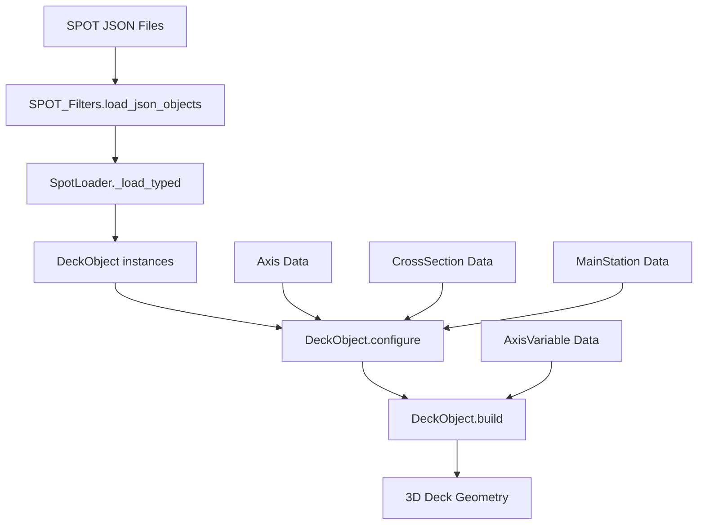

# Deck Construction Workflow

## Overview
The DeckObject represents a horizontal bridge deck structure that follows a curved alignment axis with cross-sections that can vary along its length. This document explains how deck construction works within the LinearObject framework.

## Key Components

### 1. DeckObject Class
**Location**: `models/deck_object.py`
**Parent**: `LinearObject`

The DeckObject inherits from LinearObject and provides specialized deck construction functionality:

```python
@dataclass
class DeckObject(LinearObject):
    # Basic identification
    name: str = ""
    axis_name: str = ""                    # Reference to alignment axis
    
    # Cross-section management  
    cross_section_ncs: List[int] = field(default_factory=list)
    cross_section_steps: List[Dict] = field(default_factory=list)
    
    # Station-based properties
    axis_variables: List[Dict] = field(default_factory=list)  # Variable geometry
```

### 2. Construction Process

#### Step 1: Axis-based Geometry
Unlike piers which create vertical axes, decks follow existing horizontal alignment axes:
- **Axis Reference**: Uses `axis_name` to link to pre-defined alignment
- **Station Coverage**: Follows the full length of the alignment axis
- **Curve Following**: Geometry adapts to horizontal and vertical curves

#### Step 2: Cross-section Variation
Decks support complex cross-section changes along their length:
- **Section Steps**: Discrete changes at specific stations
- **Variable Geometry**: Continuous variation via axis variables
- **Multiple Sections**: Different sections for different spans

#### Step 3: Build Process
The `build()` method creates the 3D deck geometry:

1. **Station Sampling**: Determines evaluation points along axis
2. **Section Selection**: Chooses appropriate cross-section at each station  
3. **Variable Evaluation**: Computes geometry parameters from axis variables
4. **Mesh Generation**: Creates 3D surface from cross-sections + variables

## Architecture Integration

### LinearObject Framework
DeckObject leverages the full LinearObject capabilities:

```python
# Inherited from LinearObject:
base_section: Optional[CrossSection]           # Default section
ncs_steps: Optional[List[Tuple[float, int]]]   # [(station_m, ncs), ...]
sections_by_ncs: Optional[Dict[int, CrossSection]]  # ncs -> section mapping
mainstations: Optional[List[MainStationRef]]   # Rotation data
```

### Cross-section Management
Decks use sophisticated cross-section handling:

```python
def _sections_for_stations(ctx, stations_m, *, schedule=None, names=None, ncs_list=None):
    # Supports:
    # - Piecewise-constant scheduling
    # - Per-station section names  
    # - Constant section fallback
```

### Variable Geometry System
Deck geometry can vary continuously via AxisVariable system:

```python
def interp_axis_variables(axis_var_rows, section_defaults_mm, stations_m):
    # Interpolates variables like:
    # - Deck width variations
    # - Barrier heights
    # - Girder spacing
    # - Slab thickness
```

## Data Flow



## Key Features

### Station-based Construction
Decks are built by evaluating cross-sections at multiple stations along the axis:

```python
# Station sampling considers:
stations_m = self._station_array(stations_m, station_cap)  # User stations or auto
crit_m = self._collect_critical_stations()                 # Critical points
S_unified = self._unique_sorted_union(base_samples_m + crit_m)  # Combined
```

### Cross-section Sequencing  
Decks can change cross-sections along their length:

```python
# NCS steps define section changes:
ncs_steps = [(0.0, 101), (500.0, 102), (1000.0, 103)]  # station_m, ncs
# Results in section 101 from 0-500m, 102 from 500-1000m, etc.
```

### Variable Geometry
Geometry parameters can vary continuously:

```python
# Example axis variables:
axis_variables = [
    {"VariableName": "DeckWidth", "StationValue": [0, 1000], "VariableValues": [12.0, 15.0]},
    {"VariableName": "SlabThickness", "StationValue": [0, 500, 1000], "VariableValues": [0.25, 0.3, 0.25]}
]
```

## Usage Examples

### Basic Deck (run_deck.py)
```python
# Load deck from JSON
deck_rows = json.load(open(obj_json))
obj = from_dict(DeckObject, deck_row, mapping)

# Configure with components
obj.configure(available_axes, available_cross_sections, available_mainstations)

# Build geometry
result = obj.build(stations_m=None, twist_deg=0.0, plan_rotation_deg=0.0)
```

### LinearObject Workflow (run_linear.py) 
```python
# Generic handling works for decks:
if obj_type == "DeckObject":
    obj_class = DeckObject
    obj_mapping = mapping["DeckObject"]

obj = from_dict(obj_class, obj_row, obj_mapping)
obj.configure(available_axes, available_cross_sections, available_mainstations)
res = obj.build(stations_m=None, twist_deg=twist_deg, plan_rotation_deg=plan_rotation_deg)
```

## Architecture Recommendations

### Current Strengths
- **Flexible Section Management**: Supports complex section variations
- **Variable Geometry**: Continuous parameter interpolation  
- **Linear Framework**: Benefits from LinearObject infrastructure
- **SPOT Integration**: Works with SPOT_Filters loading system

### Streamlining Opportunities
1. **Simplified Configuration**: Reduce boilerplate in cross-section setup
2. **Auto-discovery**: Automatic detection of required axis variables
3. **Template System**: Pre-configured deck types (box girder, slab, etc.)
4. **Validation**: Better error handling for missing/invalid sections

### Integration Issues
- **Multiple Loading Paths**: Inconsistent between runners
- **Configuration Complexity**: Many optional parameters need simplification  
- **Section Resolution**: Manual NCS to CrossSection mapping is error-prone
- **Variable Dependencies**: Axis variables not validated against section needs

### Proposed Improvements
- **DeckBuilder Pattern**: Fluent API for deck construction
- **Automatic Setup**: Infer configuration from deck data + available components
- **Type Safety**: Better validation of cross-section/variable compatibility  
- **Unified Interface**: Single path for deck creation across all runners