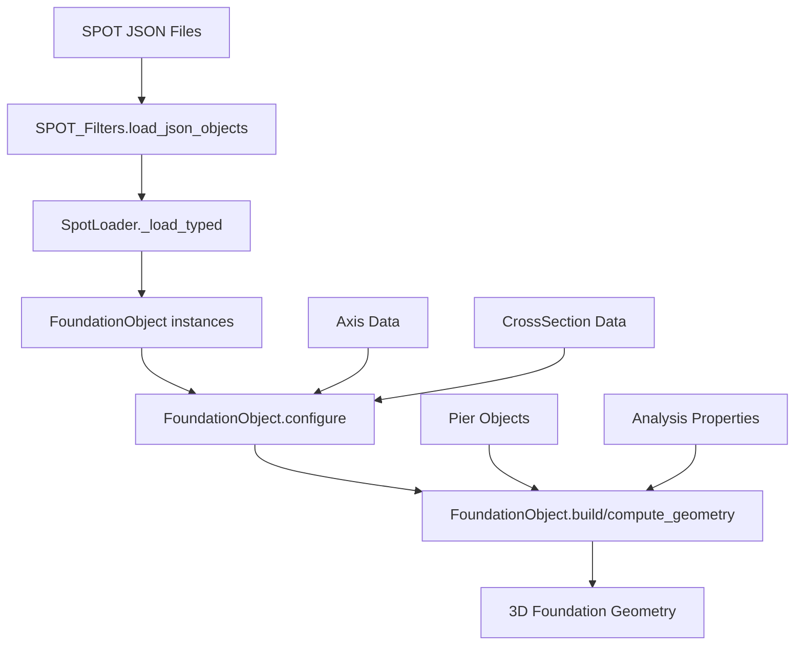

# Foundation Construction Workflow

## Overview
The FoundationObject represents foundation elements (footings, pile caps, etc.) that anchor pier or deck elements to the ground. This document explains how foundation construction works within the LinearObject framework.

## Key Components

### 1. FoundationObject Class
**Location**: `models/foundation_object.py`
**Parent**: `LinearObject`

The FoundationObject inherits from LinearObject and provides specialized foundation construction functionality:

```python
@dataclass
class FoundationObject(LinearObject):
    # Basic identification
    name: str = ""
    type: str = ""                         # Foundation type (footing, pile cap, etc.)
    axis_name: str = ""                    # Reference axis
    
    # Positioning and geometry
    station_value: float = 0.0             # Position along axis
    foundation_level: float = 0.0          # Elevation level
    foundation_ref_point_y_offset: float = 0.0  # Lateral offset
    foundation_ref_point_x_offset: float = 0.0  # Longitudinal offset
    rotation_angle: float = 0.0            # Orientation
    
    # Cross-section references
    cross_section_ncs2: int = 0            # Primary section NCS
    cross_section_name: str = ""           # Section name reference
    
    # Pile-specific properties  
    pile_dir_angle: float = 0.0            # Pile inclination
    pile_slope: float = 0.0                # Pile slope
    
    # Spring properties (for analysis)
    kx: float = 0.0                        # X-direction stiffness
    ky: float = 0.0                        # Y-direction stiffness  
    kz: float = 0.0                        # Z-direction stiffness
    rx: float = 0.0                        # X-rotation stiffness
    ry: float = 0.0                        # Y-rotation stiffness
    rz: float = 0.0                        # Z-rotation stiffness
    
    # Associated elements
    pier_object_name: List[str] = field(default_factory=list)  # Connected piers
```

### 2. Construction Process

#### Step 1: Configuration
The `configure()` method sets up the foundation with available components:
- **Axis Reference**: Links to alignment or placement axis
- **Cross-section Assignment**: Maps NCS values to section geometry
- **Position Calculation**: Determines world coordinates from axis + offsets

#### Step 2: Build Process
The foundation build process varies by type but generally:

1. **Position Resolution**: Calculates foundation location from axis + station + offsets
2. **Orientation Setup**: Applies rotation_angle and pile_dir_angle
3. **Section Evaluation**: Generates cross-section geometry at foundation level
4. **3D Mesh Creation**: Creates foundation volume/surface

## Architecture Integration

### LinearObject Framework
FoundationObject uses LinearObject capabilities selectively:

```python
# LinearObject provides infrastructure but foundations may override:
def configure(self, available_axes, available_cross_sections, available_mainstations)
def build(self, stations_m, twist_deg, plan_rotation_deg) -> Dict
```

### Specialized Foundation Behavior
Foundations often require custom geometry logic:

```python
def compute_geometry(self, *, ctx, stations_m=None, twist_deg=0.0, negate_x=True):
    # Foundation-specific geometry computation
    # May not follow standard LinearObject patterns
```

### Connection Management
Foundations link to other structural elements:

```python
# Foundation connects to:
pier_object_name: List[str]        # Connected pier elements
eval_pier_object_name: str         # Primary evaluation pier
```

## Foundation Types

### 1. Spread Footings
Simple concrete pads that distribute loads:
- **Geometry**: Usually rectangular or circular sections
- **Positioning**: Centered under pier or at specific offset
- **Construction**: Single cross-section extruded to thickness

### 2. Pile Caps  
Structural elements that connect multiple piles:
- **Geometry**: Complex sections accommodating pile layouts
- **Positioning**: Coordinated with pile locations
- **Construction**: May involve multiple sections or custom geometry

### 3. Pile Foundations
Deep foundation elements:
- **Geometry**: Circular, square, or H-pile sections
- **Positioning**: Includes pile_dir_angle and pile_slope
- **Construction**: Linear extrusion along pile axis

## Data Flow



## Key Features

### Position Resolution
Foundations use complex positioning logic:

```python
# Position calculation involves:
# 1. Base position from axis at station_value
# 2. Apply foundation_ref_point_x_offset and foundation_ref_point_y_offset  
# 3. Apply rotation_angle
# 4. Set elevation to foundation_level
```

### Multi-element Coordination
Foundations often coordinate with multiple elements:

```python
# References to connected elements:
pier_object_name: List[str]           # All connected piers
internal_placement_id: List[str]      # Internal connection IDs
internal_station_value: List[float]   # Connection stations
```

### Analysis Integration
Foundations include structural analysis properties:

```python
# Spring stiffness values for analysis:
kx, ky, kz    # Translational stiffness
rx, ry, rz    # Rotational stiffness  
fixation      # Fixity conditions
```

## Usage Examples

### Basic Foundation (run_foundation.py)
```python
# Load foundation from JSON
obj_rows = json.load(open(obj_json))
obj_row = next(r for r in obj_rows if r.get("Class") == "FoundationObject")

# Create foundation object
obj = from_dict(FoundationObject, obj_row, mapping)

# Configure with components
obj.configure(available_axes, available_cross_sections, available_mainstations)

# Build geometry
result = obj.build(stations_m=None, twist_deg=0.0, plan_rotation_deg=0.0)
```

### LinearObject Workflow (run_linear.py)
```python
# Generic handling:
elif obj_type == "FoundationObject":
    obj_class = FoundationObject
    obj_mapping = mapping["FoundationObject"]

obj = from_dict(obj_class, obj_row, obj_mapping)
obj.configure(available_axes, available_cross_sections, available_mainstations)  
res = obj.build(frame_mode="symmetric")
```

## Architecture Recommendations

### Current Challenges
- **Complex Positioning**: Multiple coordinate systems and offsets
- **Type Variations**: Different foundation types need different geometry logic
- **Multi-element Coordination**: Complex relationships with piers/decks  
- **Analysis Integration**: Mixing geometry with structural properties

### Streamlining Opportunities
1. **Type-specific Builders**: Separate builders for footings, pile caps, piles
2. **Position Helpers**: Utility functions for common positioning patterns
3. **Connection Management**: Better tools for managing element relationships
4. **Validation**: Verify foundation-pier compatibility

### Integration Issues  
- **Inconsistent Geometry**: Some foundations use compute_geometry(), others use build()
- **Configuration Complexity**: Many type-specific parameters  
- **Coordinate Systems**: Multiple reference frames cause confusion
- **Analysis Mixing**: Structural properties mixed with geometry

### Proposed Improvements
- **FoundationFactory**: Type-aware foundation creation
- **Unified Positioning**: Standard coordinate transformation system
- **Connection Validation**: Automatic checking of foundation-pier compatibility
- **Geometry Separation**: Separate geometry from analysis properties
- **Builder Pattern**: Fluent API like other LinearObject types

## Integration with LinearObject Workflow

### Strengths
- **Common Interface**: configure() and build() methods provide consistency
- **SPOT Integration**: Works with existing SPOT_Filters loading
- **Extensibility**: LinearObject framework allows customization

### Gaps
- **Geometry Variations**: Foundation geometry often doesn't fit linear patterns
- **Multiple Outputs**: May need both geometry and analysis data
- **Complex Dependencies**: Foundation placement depends on other elements

### Recommendations for Streamlining
1. **Standardize build()**: Make all foundations use LinearObject.build() consistently
2. **Position Abstraction**: Create standard foundation positioning system  
3. **Type System**: Better foundation type management and validation
4. **Integration Testing**: Verify foundation-pier-deck coordination