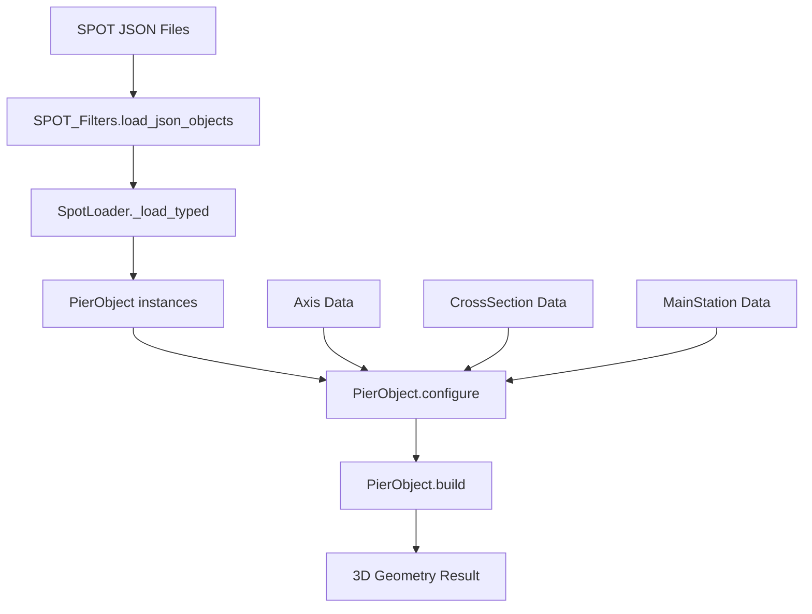

# Pier Construction Workflow

## Overview
The PierObject represents a vertical structural element (pier/column) that is constructed from cross-sectional geometry extruded along a vertical axis. This document explains how pier construction works within the LinearObject framework.

## Key Components

### 1. PierObject Class
**Location**: `models/pier_object.py`
**Parent**: `LinearObject`

The PierObject inherits from LinearObject and provides specialized pier construction functionality:

```python
@dataclass
class PierObject(LinearObject):
    station_value: float = 0.0              # Position along placement axis
    height_m: Optional[float] = None         # Pier height in meters
    plan_rotation_add_deg: float = 0.0       # Additional rotation
    
    # Cross-section references
    top_cross_section_ncs: int = 0           # NCS for top section
    bot_cross_section_ncs: int = 0           # NCS for bottom section
    internal_cross_section_ncs: List[int]    # Internal section transitions
    internal_ref_station_offset: List[float] # Offsets for transitions
```

### 2. Construction Process

#### Step 1: Configuration
The `configure()` method sets up the pier with available components:
- **Axis Selection**: Uses `axis_name` to select from available axes
- **Cross-section Assignment**: Maps NCS values to CrossSection objects  
- **Mainstation Integration**: Links to rotation/alignment data

#### Step 2: Build Process  
The `build()` method creates the 3D geometry:

1. **Vertical Axis Creation**: Creates a simple vertical axis from base to top
2. **Section Sequencing**: Applies cross-section changes along height
3. **Geometry Generation**: Uses LinearObject.build() to create 3D mesh
4. **Anchor Positioning**: Places pier in world coordinates

## Architecture Integration

### LinearObject Integration
PierObject leverages the LinearObject framework:

```python
# LinearObject provides:
def configure(self, available_axes, available_cross_sections, available_mainstations)
def build(self, stations_m, twist_deg, plan_rotation_deg) -> Dict
```

### SPOT_Filters Integration  
PierObject can be loaded from SPOT JSON data using the SPOT_Filters system:

```python
# Loading process:
1. SPOT_Filters.load_json_objects() -> Raw JSON data
2. SpotLoader._load_typed(PierObject, raw_data) -> PierObject instances
3. PierObject.configure() -> Setup with parsed components
4. PierObject.build() -> Generate 3D geometry
```

## Data Flow



## Key Methods

### configure()
Sets up pier with available resources:
- Links to placement axis for positioning
- Maps NCS values to cross-section objects
- Assigns mainstation data for rotations

### build()  
Generates 3D pier geometry:
- Creates vertical axis from base position + height
- Applies cross-section sequencing if defined
- Calls LinearObject.build() for mesh generation
- Returns geometry data + metadata

## Usage Examples

### Minimal Pier (run_pier.py)
```python
# Load basic components
axis_rows = json.load(open(axis_json))
cross_rows = json.load(open(cross_json)) 
pier_rows = json.load(open(obj_json))

# Create pier objects
piers = simple_load_piers(pier_rows)
pier = piers[0]

# Configure and build
pier.configure(axes, cross_sections, mainstations)
result = pier.build(manual=True, vertical_slices=6)
```

### LinearObject Workflow (run_linear.py)
```python
# Generic linear object handling
obj = from_dict(PierObject, obj_row, mapping)
obj.configure(available_axes, available_cross_sections, available_mainstations)
result = obj.build(stations_m=None, twist_deg=0.0, plan_rotation_deg=0.0)
```

## Architecture Recommendations

### Streamlining Opportunities
1. **Unified Loading**: Consolidate pier loading through LinearObject interface
2. **SPOT Integration**: Direct integration of SPOT_Filters with LinearObject workflow
3. **Configuration Simplification**: Reduce boilerplate in configure() calls
4. **Builder Pattern**: Consider fluent API for pier construction

### Current Issues
- Multiple loading paths (simple_load_piers vs from_dict)
- Complex configuration with many optional parameters  
- Inconsistent axis handling between placement and vertical axes
- Manual cross-section mapping requirements

### Proposed Improvements
- Single `PierBuilder` class combining loading + configuration
- Automatic axis selection based on pier data
- Simplified cross-section assignment
- Better integration with SPOT_Filters workflow