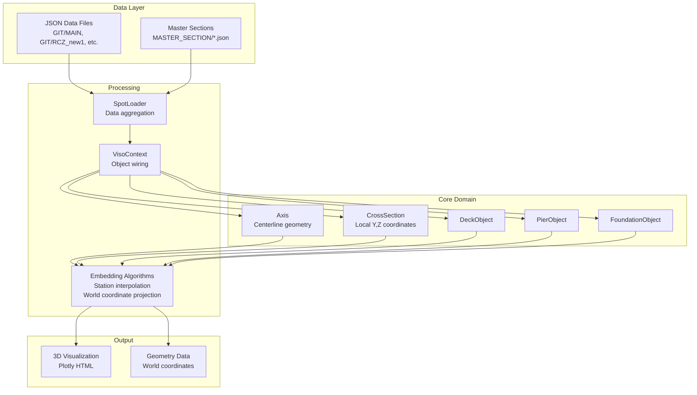

# SPOT VISO - Executive Summary

## Project Purpose

SPOT VISO is a **structural visualization and geometry computation system** designed for parametric bridge modeling and analysis. It transforms JSON-based bridge component definitions (axes, cross-sections, deck/pier/foundation objects) into precise 3D geometric representations through advanced coordinate embedding algorithms. The system supports multi-branch data organization, modular component architecture, and sophisticated geometric operations including station interpolation, cross-section embedding with symmetry handling, and parallel transport frame calculations for accurate structural visualization in engineering workflows.

## Current Architecture

**Major Modules:**
- `models/` - Core domain objects (Axis, CrossSection, *Object classes)
- `spot_loader.py` - Data loading and aggregation from JSON sources
- `SPOT_Filters.py` - JSON processing and filtering utilities
- `run_*.py` - CLI entry points for different object types
- `main.py` - Interactive visualization and batch processing

## Key Entry Points & Runtime Path

**CLI Commands:**
- `run_deck.py` - Bridge deck visualization with rotation/frame controls
- `run_pier.py` - Pier structure analysis and rendering  
- `run_foundation.py` - Foundation geometry processing
- `run_linear.py` - Unified runner supporting all object types
- `main.py` - Interactive mode with full SpotLoader workflow

**Typical Runtime Path:**
1. **Load**: SpotLoader aggregates JSON data from GIT/{branch}/
2. **Parse**: SPOT_Filters processes and enriches object definitions
3. **Wire**: VisoContext resolves references and builds object graph
4. **Compute**: Domain objects call embedding algorithms (CrossSection.compute_embedded_points)
5. **Render**: Plotly generates 3D HTML visualization

## Top 5 Risks/Blockers & Quick Wins

### **Risks/Blockers:**
1. **Performance Bottleneck** - Nested loops in station iteration without vectorization (models/cross_section.py:compute_embedded_points)
2. **Missing Test Coverage** - No pytest infrastructure, only manual test scripts
3. **Hardcoded Paths** - Windows-specific paths in SPOT_Filters.py limit cross-platform usage
4. **Memory Scaling** - Large station counts (>1000) with complex cross-sections may cause OOM
5. **Algorithm Fragility** - `embed_section_points_world_symmetric` has known broadcasting errors in edge cases

### **Quick Wins:**
1. **Vectorize Station Processing** - Replace loops with numpy operations (2-5x performance gain)
2. **Add Smoke Tests** - Create `test -m smoke` command with <60s runtime validation
3. **Cross-Platform Paths** - Convert absolute paths to pathlib.Path usage  
4. **CLI Standardization** - Implement missing `spotviso check` and `spotviso viz` commands
5. **Caching Layer** - Add LRU cache to expensive geometry computations

## Focused Questions for Maintainer

1. **Coordinate System Convention**: Confirm Y-axis direction (outward/inward from centerline) and Z-up convention across all object types
2. **Station Interpolation**: Is linear interpolation sufficient or do you need spline/bezier for curved segments?
3. **Performance Requirements**: What's the target station count and cross-section complexity for typical production models?
4. **Symmetric vs PT Frames**: When should engineers prefer `--frame-mode symmetric` over `--frame-mode pt`?
5. **Error Tolerance**: What geometric tolerances are acceptable for overlap detection and section embedding?
6. **Data Versioning**: How do you handle schema evolution between GIT branches (MAIN vs RCZ_new1 vs RCZ_new)?
7. **Validation Rules**: Are there geometric constraints that should be enforced (min section spacing, axis curvature limits)?
8. **Output Format**: Besides HTML/Plotly, do you need exports to CAD formats (STEP, IFC) or analysis tools (FEA)?
9. **Multi-Axis Support**: Can a single model span multiple axes or are they always single-axis projects?
10. **Security & Secrets**: Are there credential requirements for accessing remote data sources or cloud deployments?
11. **CI/CD Integration**: What's the preferred workflow for automated testing and deployment validation?
12. **MCP Tool Priorities**: Which geometry operations would be most valuable as MCP-exposed functions (plot generation, data extraction, validation)?