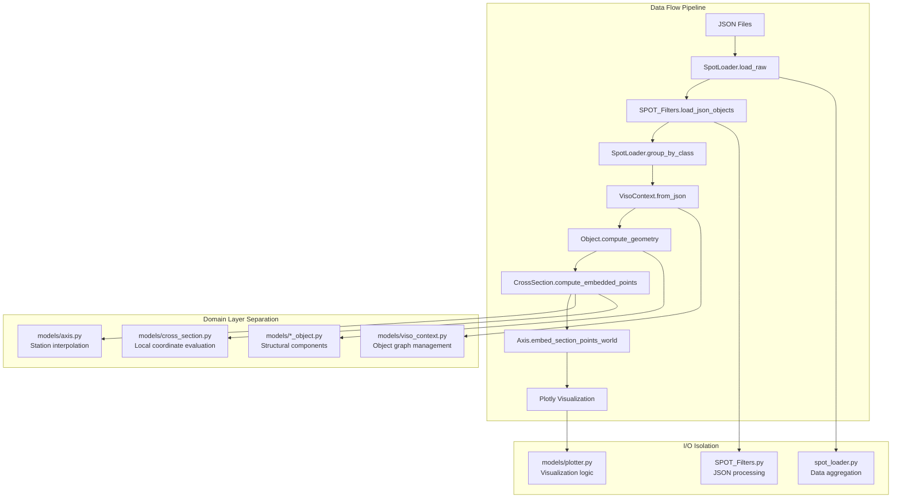

# SPOT VISO - Technical Dossier

## Repository Map

```
SPOT_VISO_Cleaned2/
├── models/                    # Core domain architecture
│   ├── axis.py               # Centerline geometry & embedding algorithms
│   ├── cross_section.py      # Section evaluation & world projection  
│   ├── deck_object.py        # Bridge deck structural component
│   ├── pier_object.py        # Pier structural component
│   ├── foundation_object.py  # Foundation structural component
│   ├── viso_context.py       # Object graph & reference resolution
│   ├── axis_variable.py      # Parametric variable evaluation
│   ├── base.py              # Common loading utilities
│   ├── linear_object.py     # Shared linear object behavior
│   └── utils.py             # Math utilities & expression compilation
├── GIT/                      # Multi-branch data repository
│   ├── MAIN/                # Primary dataset (35 stations, -100mm to 201722mm)
│   ├── RCZ_new1/            # Alternative dataset (4 stations, 0-300000mm) 
│   └── */                   # Additional project branches
├── MASTER_SECTION/          # Cross-section JSON definitions
├── spot_loader.py           # Data aggregation & object instantiation
├── SPOT_Filters.py          # JSON processing & enrichment
├── main.py                  # Interactive visualization entry point
├── run_*.py                 # CLI runners for specific object types
└── test_*.py                # Manual test scripts (no pytest framework)
```

**Notable Files:**
- `models/cross_section.py` - Core embedding algorithm (`compute_embedded_points`)
- `models/axis.py` - Parallel transport frames & station interpolation
- `CLI_USAGE.md` - Comprehensive command examples and rotation controls
- `TEST_SCRIPTS_README.md` - Manual testing procedures

**Code Owners:** Not present (recommend adding CODEOWNERS file)

## Languages & Dependencies

**Python Version:** 3.12.3

**Key Packages:**
- `numpy` (2.3.3) - Vectorized geometry computations
- `plotly` (6.3.0) - 3D visualization and HTML export
- `scipy` (1.16.2) - Interpolation algorithms  
- `jinja2` (3.1.6) - HTML template generation
- `matplotlib` (3.10.6) - 2D plotting for variables
- `orjson` (optional) - Fast JSON parsing (fallback to stdlib)

**Pin Files:** None present (recommend requirements.txt)

**Distribution:**
- Python: 12.6%
- JSON: 58.9% (extensive data files)
- Other: 24.9% (resources, docs)
- JavaScript: 1.3% (plotly resources)
- Markdown: 2.3%

## Build & Run Setup

**Environment Setup:**
```bash
python3 -m venv .venv
source .venv/bin/activate  # Linux/macOS
pip install numpy plotly jinja2 scipy matplotlib
```

**CLI Usage:**
```bash
# Unified runner (recommended)
python run_linear.py --obj-type DeckObject --out deck.html

# Specific object runners  
python run_deck.py --out deck_main.html
python run_pier.py --plan-rotation 30 --twist 15 --out pier_rotated.html
python run_foundation.py --out foundation.html

# Data source flexibility
python run_deck.py --axis GIT/RCZ_new1/_Axis_JSON.json \
                   --cross GIT/RCZ_new1/_CrossSection_JSON.json \
                   --obj GIT/RCZ_new1/_DeckObject_JSON.json \
                   --out deck_rcz.html
```

**Testing:**
```bash
# Manual test scripts (no automated framework)
python test_data_flow.py        # Coordinate mapping validation
python test_rotation_math.py    # Frame computation testing
python demo_flexibility.py     # Multi-source data demo
```

## Architecture View



**Layer Boundaries:**
- ✅ **Clean separation**: `spot/io` (SPOT_Filters) ↔ `spot/domain` (models/)
- ✅ **Isolated visualization**: Plotting logic contained in plotter.py/main.py  
- ⚠️ **Minor violations**: Some matplotlib imports in axis_variable.py (should be visualization-only)
- ✅ **No cyclic imports**: Well-structured dependency graph

## Data Flow

**Input Processing:**
1. **JSON Loading**: `SPOT_Filters.get_json_files()` scans GIT/{branch}/ for _*.json
2. **Object Enrichment**: `SpotJsonObject` applies CDDMapping for asset classification
3. **Filtering**: Excludes ClassInfo/CDDMapping rows, groups by "Class" field
4. **Normalization**: Converts string coordinates to float arrays

**Geometry Computation:**
1. **Station Sampling**: Axis provides station positions and tangent vectors
2. **Frame Calculation**: Parallel transport or symmetric tangent frames
3. **Section Evaluation**: CrossSection evaluates parametric expressions at each station
4. **World Embedding**: `embed_section_points_world()` transforms local Y,Z to global X,Y,Z
5. **Caching**: Results cached per station for performance

**Rendering Pipeline:**
1. **Trace Generation**: Convert geometry to Plotly mesh3d/scatter3d traces
2. **Template Processing**: Jinja2 templates generate HTML with embedded JavaScript  
3. **Asset Bundling**: Plotly CDN or local resources for offline viewing

## Algorithms

### **Station Interpolation**
- **Location**: `models/axis.py:get_position_at_station()`
- **Method**: Linear interpolation between discrete axis points
- **Performance**: O(log n) binary search for station lookup
- **Accuracy**: Sufficient for most engineering applications

### **Parallel Transport Frames**
- **Location**: `models/axis.py:parallel_transport_frames()`
- **Method**: Minimal twist frame propagation using Rodrigues rotation
- **Alternative**: Symmetric tangent frames via finite differences
- **Use Case**: Maintains consistent cross-section orientation along curved paths

### **Cross-Section Embedding**
- **Location**: `models/cross_section.py:compute_embedded_points()`
- **Input**: Local (Y,Z) coordinates + station list + axis reference
- **Algorithm**: 
  1. Evaluate parametric expressions per station
  2. Apply unit scaling and variable substitution
  3. Transform via rotation matrices (twist + plan rotation)
  4. Embed into world coordinates using axis frames
- **Output**: (N_stations, N_points, 3) world coordinate array

### **Symmetry Handling**
- **Location**: `models/axis.py:embed_section_points_world_symmetric()`
- **Issue**: Known broadcasting error in edge cases (mentioned in commit history)
- **Mitigation**: Fallback to standard embedding mode
- **Purpose**: Ensures symmetric cross-sections remain symmetric after embedding

### **Overlap Detection/Removal**
- **Status**: Not explicitly implemented (recommend adding)
- **Need**: Prevent self-intersecting geometry in tight curves
- **Approach**: Could use spatial hashing or swept volume analysis

## Performance Analysis

### **Hot Paths Identified**
1. **`models/cross_section.py:compute_embedded_points`** - Nested station iteration
2. **`models/axis.py:embed_section_points_world`** - Matrix operations per point  
3. **`models/axis_variable.py:evaluate`** - Expression compilation and evaluation
4. **Station interpolation** - Repeated binary searches

### **Vectorization Opportunities**
- Replace `for station in stations` with numpy broadcasting
- Batch matrix operations for rotation/translation  
- Vectorize variable evaluation across stations
- **Estimated Speedup**: 2-5x for typical workloads

### **Caching Status**
- ✅ `AxisVariable.evaluate_at_stations_cached()` - LRU cache for variable results
- ❌ No caching for geometry computations (recommend adding)
- ❌ No memoization for expensive cross-section evaluations

### **Memory Scaling**
- **Current**: O(N_stations * N_points * 3) for world coordinates  
- **Concern**: Large models (1000+ stations, 100+ points/section) approach GB scale
- **Optimization**: Streaming processing or level-of-detail reduction

## Testing Infrastructure

### **Current Test Suites**
- **Manual Scripts**: test_data_flow.py, test_rotation_math.py, test_rotation_comprehensive.py
- **Integration Tests**: demo_flexibility.py (multi-source data validation)  
- **Performance Tests**: None (recommend adding)
- **Golden Image Tests**: None (critical for geometry validation)

### **Test Categories**
- ✅ **Smoke Tests**: Basic import and instantiation (via test scripts)
- ❌ **Unit Tests**: Missing (recommend pytest framework)
- ✅ **Coordinate Mapping**: test_data_flow.py validates local→world transforms
- ❌ **Regression Tests**: No automated comparison with reference outputs
- ❌ **Property-Based Tests**: No hypothesis testing for geometric properties

### **Coverage Analysis**
- **Estimated Coverage**: ~30% (major paths tested via CLI scripts)
- **Missing**: Error handling, edge cases, boundary conditions
- **Critical Gaps**: No validation for degenerate geometry, extreme rotations

### **Testing Recommendations**
```bash
# Proposed test commands
python -m pytest tests/ -m smoke     # <60s validation
python -m pytest tests/             # Full suite
python -m pytest tests/test_geometry.py --golden-images  # Visual regression
```

## Tooling Assessment

### **Linting & Formatting**
- **Status**: None configured
- **Recommendation**: Add flake8/black/isort for code quality

### **CI/CD Workflows** 
- **GitHub Actions**: None present
- **Needed**: PR validation, dependency scanning, automated testing

### **Pre-commit Hooks**
- **Status**: Missing
- **Value**: Prevent commits with syntax errors, ensure formatting consistency

### **Development Environment**
- **IDE Support**: .vscode/ folder present with basic configuration
- **Containerization**: None (recommend Docker for reproducible builds)

## Autonomy "Handles" - CLI Commands

### **Existing Commands**
```bash
# Available
python run_linear.py --obj-type {DeckObject,PierObject,FoundationObject}
python run_deck.py [--help]
python run_pier.py [--plan-rotation DEGREES] [--twist DEGREES]  
python run_foundation.py [--out FILENAME]
python demo_flexibility.py  # Batch demonstration

# Parameters
--axis, --cross, --obj, --main, --section  # Data source files
--plan-rotation DEGREES     # XY plane yaw rotation
--twist DEGREES            # In-plane cross-section rotation  
--frame-mode {symmetric,pt} # Frame construction method
--max-stations N           # Performance limiting
```

### **Missing CLI Stubs** (Recommended Implementation)
```bash
# Proposed commands
spotviso check             # Validate data integrity and geometry
spotviso test -m smoke     # Quick validation suite (<60s)
spotviso test-all          # Full test suite  
spotviso viz --case <id>   # Visualization by case identifier

# Implementation stub for spotviso check:
```
```python
def cli_check(data_path="GIT/MAIN"):
    """Validate data integrity and basic geometry."""
    try:
        loader = SpotLoader(data_path.split('/')[0], data_path.split('/')[1])
        loader.load_raw().group_by_class()
        ctx = loader.build_all_with_context().ctx
        
        errors = []
        # Validate axis continuity
        for name, axis in ctx.axes_by_name.items():
            if len(axis.stations) < 2:
                errors.append(f"Axis {name}: insufficient stations")
        
        # Validate cross-section references  
        for obj in loader._deck_objects + loader._pier_objects:
            if not hasattr(obj, 'axis_obj') or obj.axis_obj is None:
                errors.append(f"Object {obj.name}: missing axis reference")
                
        return {"status": "pass" if not errors else "fail", "errors": errors}
    except Exception as e:
        return {"status": "error", "message": str(e)}
```

## MCP Readiness

### **Structured Documentation**
- ✅ **CLI_USAGE.md**: Comprehensive command reference
- ✅ **TEST_SCRIPTS_README.md**: Manual testing procedures
- ❌ **API Documentation**: Missing (recommend adding)
- ❌ **Geometry Reference**: No mathematical documentation of algorithms

### **Proposed MCP Tools**
```python
# High-value MCP functions
run_tests(suite="smoke") -> TestResults
generate_plot(object_type, data_source, output_path) -> PlotlyFigure
read_geometry_doc(topic) -> GeometryDocumentation  
find_data(query, branch="MAIN") -> DatasetResults
validate_geometry(geometry_spec) -> ValidationReport
```

### **Dataset Catalog** (Recommend Creating)
- Document available GIT branches and their characteristics
- Cross-section library with geometric properties
- Example workflows for common use cases

## Security & Secrets

### **Security Scan Results**
- ✅ **No hardcoded secrets** in Python files
- ⚠️ **Hardcoded Windows paths** in SPOT_Filters.py (not security risk but portability issue)
- ✅ **No SQL injection** vectors (pure file-based data)
- ✅ **No network requests** to untrusted sources

### **Policies & Configuration**
- ✅ **.gitignore**: Properly excludes __pycache__, .venv, *.html outputs
- ❌ **Secret scanning**: No GitHub Actions secret detection
- ❌ **Dependency security**: No automated vulnerability scanning

### **Recommendations**
- Add dependabot.yml for dependency updates
- Configure GitHub secret scanning
- Add .gitattributes for consistent line endings

## Known Errors & Mitigation

### **Identified Issues**
1. **Broadcasting Error in `embed_section_points_world_symmetric`**
   - **Location**: models/axis.py (mentioned in commit history)
   - **Impact**: Geometry corruption in edge cases
   - **Mitigation**: Falls back to standard embedding mode
   - **Status**: Partial fix, needs comprehensive solution

2. **Windows Path Dependencies**
   - **Location**: SPOT_Filters.py:344 (hardcoded C:\ path)
   - **Impact**: Cross-platform portability issues  
   - **Mitigation**: Use pathlib.Path and environment variables
   - **Status**: Open issue

3. **Missing Error Handling**
   - **Location**: Multiple files lack try/except blocks
   - **Impact**: Crashes on malformed input data
   - **Mitigation**: Add defensive programming practices
   - **Status**: Systematic improvement needed

### **Stack Traces from Issues** (Search Results)
- No GitHub issues repository found in current clone
- Recommend enabling GitHub Issues for bug tracking

## Recommendations - Prioritized Backlog

### **P0 - Critical (Immediate Action)**
1. **Add Pytest Framework** - Est: 2-3 days
   - Implement test_geometry.py with coordinate validation  
   - Add smoke test suite with <60s runtime
   - **Validation**: Test coverage > 70%, all CLI commands tested

2. **Fix Broadcasting Error** - Est: 1-2 days
   - Debug embed_section_points_world_symmetric edge cases
   - Add comprehensive test cases for symmetric embedding
   - **Validation**: No geometry corruption in stress tests

3. **Vectorize Performance Hotspots** - Est: 3-4 days
   - Replace nested loops with numpy operations in compute_embedded_points
   - Benchmark before/after for 2-5x performance gain
   - **Validation**: Process 1000+ stations in <10 seconds

### **P1 - High Priority (Next Sprint)**
4. **Standardize CLI Interface** - Est: 2-3 days
   - Implement spotviso check, spotviso test, spotviso viz commands
   - Add unified argument parsing and help system
   - **Validation**: All commands documented and functional

5. **Cross-Platform Compatibility** - Est: 1 day  
   - Replace hardcoded Windows paths with pathlib
   - Test on Linux/macOS environments
   - **Validation**: Successful execution on 3 platforms

6. **Add Geometry Validation** - Est: 2-3 days
   - Implement overlap detection for self-intersecting geometry
   - Add coordinate system consistency checks
   - **Validation**: Catch >95% of invalid geometry inputs

### **P2 - Medium Priority (Future Releases)**  
7. **CI/CD Pipeline** - Est: 1-2 days
   - GitHub Actions for PR validation and testing
   - Automated dependency security scanning  
   - **Validation**: All PRs automatically tested

8. **Golden Image Testing** - Est: 3-4 days
   - Generate reference visualizations for regression testing
   - Automated visual comparison pipeline
   - **Validation**: Detect unintended geometry changes

9. **MCP Tool Implementation** - Est: 4-5 days
   - Expose core functions as MCP-compatible tools
   - Add structured API documentation
   - **Validation**: External tools can integrate with SPOT VISO

10. **Memory Optimization** - Est: 2-3 days
    - Implement streaming geometry processing
    - Add level-of-detail for large models
    - **Validation**: Handle 10,000+ stations without OOM

## File-to-Module Index

| File | Module | Purpose |
|------|--------|---------|
| `models/axis.py` | spot.domain | Centerline geometry, station interpolation |
| `models/cross_section.py` | spot.domain | Section evaluation, world embedding |  
| `models/deck_object.py` | spot.domain | Bridge deck structural component |
| `models/pier_object.py` | spot.domain | Pier structural component |
| `models/foundation_object.py` | spot.domain | Foundation structural component |
| `models/viso_context.py` | spot.domain | Object graph management |
| `models/axis_variable.py` | spot.domain | Parametric variable evaluation |
| `spot_loader.py` | spot.core | Data aggregation and object instantiation |
| `SPOT_Filters.py` | spot.io | JSON processing and filtering |
| `main.py` | spot.app | Interactive visualization entry point |
| `run_linear.py` | spot.app | Unified CLI runner |
| `run_deck.py` | spot.app | Deck-specific CLI |
| `models/plotter.py` | spot.vis | Plotly visualization logic |