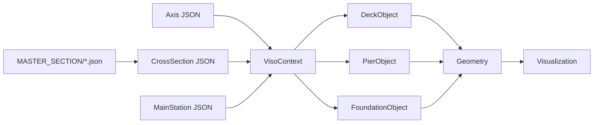

# SPOT VISO - Workflow Dataflow

## Data Pipeline: Inputs → Loaders → Compute → Visualization/Export

```mermaid
graph TB
    subgraph "Data Sources"
        JSON1[GIT/{BRANCH}/_Axis_JSON.json]
        JSON2[GIT/{BRANCH}/_CrossSection_JSON.json] 
        JSON3[GIT/{BRANCH}/_DeckObject_JSON.json]
        JSON4[GIT/{BRANCH}/_PierObject_JSON.json]
        JSON5[GIT/{BRANCH}/_FoundationObject_JSON.json]
        JSON6[GIT/{BRANCH}/_MainStation_JSON.json]
        JSON7[MASTER_SECTION/*.json]
    end
    
    subgraph "Data Loading Layer"
        SPOT[SPOT_Filters.get_json_files]
        LOAD[SPOT_Filters.load_json_objects]
        LOADER[SpotLoader.load_raw]
        GROUP[SpotLoader.group_by_class]
    end
    
    subgraph "Object Construction"
        CTX[SpotLoader.build_all_with_context]
        VISO[VisoContext.from_json]
        OBJ[*Object instantiation]
    end
    
    subgraph "Geometry Computation"
        COMP[LinearObject.compute_geometry_vectorized]
        VARS[AxisVariable interpolation]
        LOCAL[CrossSection.evaluate]
        EMBED[CrossSection.compute_embedded_points]
        FRAMES[Axis.parallel_transport_frames]
        WORLD[Axis.embed_section_points_world]
    end
    
    subgraph "Output Generation"
        TRACES[get_plot_traces_matrix]
        PLOTLY[Plotly 3D Scene]
        HTML[Interactive HTML Output]
        CACHE[Geometry Caching]
    end
    
    JSON1 --> SPOT
    JSON2 --> SPOT
    JSON3 --> SPOT
    JSON4 --> SPOT
    JSON5 --> SPOT
    JSON6 --> SPOT
    JSON7 --> SPOT
    SPOT --> LOAD
    LOAD --> LOADER
    LOADER --> GROUP
    GROUP --> CTX
    CTX --> VISO
    VISO --> OBJ
    OBJ --> COMP
    COMP --> VARS
    COMP --> LOCAL
    LOCAL --> EMBED
    EMBED --> FRAMES
    EMBED --> WORLD
    WORLD --> TRACES
    TRACES --> PLOTLY
    PLOTLY --> HTML
    COMP --> CACHE
    
    %% Unit conversion annotations
    JSON1 -.->|coords: m| VISO
    VISO -.->|×1000| FRAMES
    VARS -.->|interpolated vars: mixed units| LOCAL
    LOCAL -.->|heuristic: m→mm| EMBED
    EMBED -.->|stations: m→mm ×1000| WORLD
    WORLD -.->|world coords: mm| TRACES
    TRACES -.->|display: mm coords| HTML
```

## Data Flow Details

### 1. Input Stage
- **GIT/{BRANCH}/** folders contain project-specific JSON files
- **MASTER_SECTION/** contains reusable cross-section definitions
- JSON files with "_" prefix are automatically discovered
- Multiple branches supported (MAIN, RCZ_new1, etc.)

### 2. Loading Layer
- **SPOT_Filters** scans folders and loads raw JSON arrays
- **SpotLoader.load_raw()** aggregates all JSON objects into flat list  
- **SpotLoader.group_by_class()** organizes by "Class" field
- Filters out metadata classes (ClassInfo, CDDMapping)

### 3. Object Construction  
- **VisoContext** builds cross-reference graph between axes, sections, stations
- Domain objects instantiated: Axis, CrossSection, *Object classes
- **Section enrichment**: Master section JSONs merged with cross-section references
- **Context wiring**: Objects linked by name/ID references

### 4. Geometry Computation Pipeline
- **Variable interpolation**: AxisVariable values interpolated to station positions
- **Local evaluation**: CrossSection.evaluate() computes (Y,Z) coordinates per station
- **Frame computation**: Axis generates parallel transport frames (tangent, normal, binormal)
- **World embedding**: Local coordinates transformed to world via rotation-minimizing frames
- **Caching**: Expensive computations cached for reuse

### 5. Visualization/Export
- **get_plot_traces_matrix()** converts geometry to Plotly trace objects
- **Plotly 3D scene** renders interactive visualization
- **HTML output** with embedded JavaScript for rotation, zoom, pan
- **Metadata overlays**: Object names, station markers, frame visualization

## Unit Conversions

| Stage | Input Units | Output Units | Conversion |
|-------|------------|--------------|------------|
| **Axis loading** | meters (JSON) | millimeters (internal) | ×1000 |
| **Station interpolation** | meters (user input) | millimeters (computation) | ×1000 |
| **CrossSection variables** | mixed (heuristic detection) | millimeters (standardized) | auto-scale 1 or ×1000 |
| **World embedding** | local: mm, stations: mm | world coordinates: mm | transformations preserve mm |
| **Plotly output** | millimeters (computation) | millimeters (display) | no conversion |

### Unit Conversion Notes
- **Heuristic scaling** in `CrossSection._fix_var_units_inplace()` compares variable medians to defaults
- **Station consistency**: All internal computations use millimeters to avoid precision loss
- **Display units**: Plotly shows millimeters; UI could add meter conversion for readability

## Caching Strategy

### Current Caching
- **Section JSON payloads**: `SpotLoader._section_payload_cache` 
- **Axis interpolation**: Uses numpy vectorized operations (implicit caching)
- **Cross-section evaluation**: Results cached per evaluate() call in `last_ids`, `last_loops_idx`

### Potential Caching Improvements
- **LRU cache** for expensive `parallel_transport_frames()` computations
- **Geometry cache** for repeated station/section combinations  
- **Variable interpolation cache** for common station sequences
- **Plotly trace cache** for unchanged objects between renders

## Data Dependencies



Objects depend on shared context for axis and section resolution, enabling complex multi-object scenes with consistent coordinate systems.